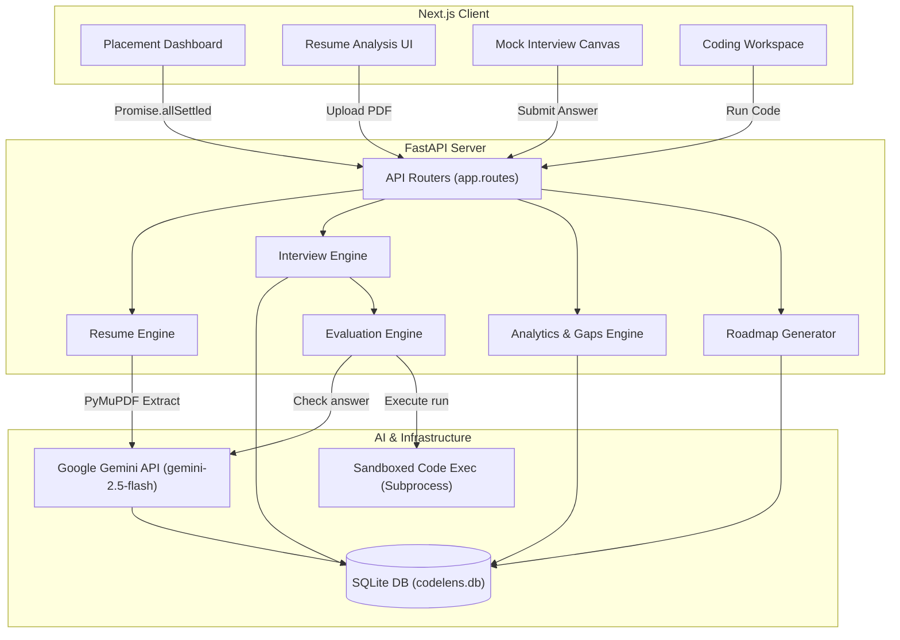

# System Architecture Documentation

This document explains the technical architecture, data flow, and module boundaries of the CodeLens AI platform.

## 📐 High-Level Architecture Flow
The application is structured into a modular Next.js frontend and a lightweight, async-capable FastAPI backend. All analytical computations (Gaps detection, roadmap formulation) are generated on-the-fly or cached inside a SQLite database.

---

## ⚙️ Core Modules Description

### 1. Frontend Dashboard (Next.js)
- **Tech Stack**: Next.js App Router, TypeScript, Tailwind CSS, Lucide React icons.
- **Responsiveness**: Utilizes CSS grid layouts, media queries, and a custom sliding mobile sidebar menu.
- **State Management**: Built-in React contexts (e.g. Toast notifications system) and local state hooks to manage interview session steps.
- **Data Loaders**: Initiates non-blocking `Promise.allSettled` request arrays to query the API endpoints concurrently, allowing individual widgets to render loading skeletons, empty states, or error retry boxes independently.

### 2. FastAPI Backend & Route Controllers
- **Tech Stack**: FastAPI, Uvicorn ASGI, Pydantic data validation schemas.
- **CORS Config**: Configured via environment variables to allow cross-origin requests from the React dev server.
- **Database Lifespan**: Automates DB initialization and checks schema column integrity on backend startup using SQLite transaction flags.

### 3. Resume Engine
- **Processing**: Reads file streams uploaded via `multipart/form-data`.
- **Text Extraction**: Uses `PyMuPDF` (Fitz) to extract plain text contents from the PDF pages.
- **AI Synthesis**: Prompts the Gemini API using structured system instructions. The model returns a parsed JSON matching `ResumeAnalysis` schema (experience, projects, skills, education, strengths, weaknesses, and readiness score).
- **Fallback Guard**: If the Gemini API is offline, it triggers a regex-based parser that segments the text content and applies standard keywords matching to avoid parsing failures.

### 4. Interview Engine
- **Session Tracking**: Generates unique session UUIDs. Keeps track of the current question index, total questions, and completion status.
- **Question Pools**: calibrates questions dynamically. It selects high-quality questions mapped to the candidate's chosen role (Frontend/Backend/Fullstack) from a pre-defined seed bank or generates them via Gemini.
- **Persistence**: Sessions are saved inside the `interviews` database table.

### 5. Evaluation Engine
- **Scoring**: Grades student text responses on a scale of 0 to 100.
- **Feedback Analysis**: Evaluates conceptual correctness, depth, and clarity, returning detailed paragraphs explaining correct answers.
- **Database Log**: Appends every question, response, and grade to the `interview_messages` table to build a training history.

### 6. Analytics & Weakness Detection
- **Aggregate Metric**: Computes cumulative average score, attempts, and trend lines across chronological rounds.
- **Gap Detection**: Groups completed questions by tag categories. Topics with average scores below 70% are classified as "Weak", between 70% and 85% as "Moderate", and above 85% as "Strong".
- **Dynamic Charting**: Returns coordinates to plot interactive performance trend lines directly via lightweight client-side SVG renderers.

### 7. Roadmap Generator
- **Personalization**: Reads the student's history of weak topics.
- **Curriculum Formulation**: Formulates a week-by-week 4-week study curriculum targeting weak areas first.
- **Resource Recommendation**: Appends relevant external study recommendations (textbooks, doc links, coding challenges).

---

## 💾 Database Schema Reference
The project uses SQLite for storage. The core schema contains:
- **`resumes`**: Stores extracted resume text and parsed JSON metadata.
- **`interviews`**: Tracks current active session, target track, completion flag, and overall cumulative score.
- **`interview_messages`**: Tracks individual questions, text responses, feedback paragraphs, category topic tags, and scores.
- **`roadmaps`**: Caches the generated study plans matching weakness fingerprints to prevent redundant LLM generations.
